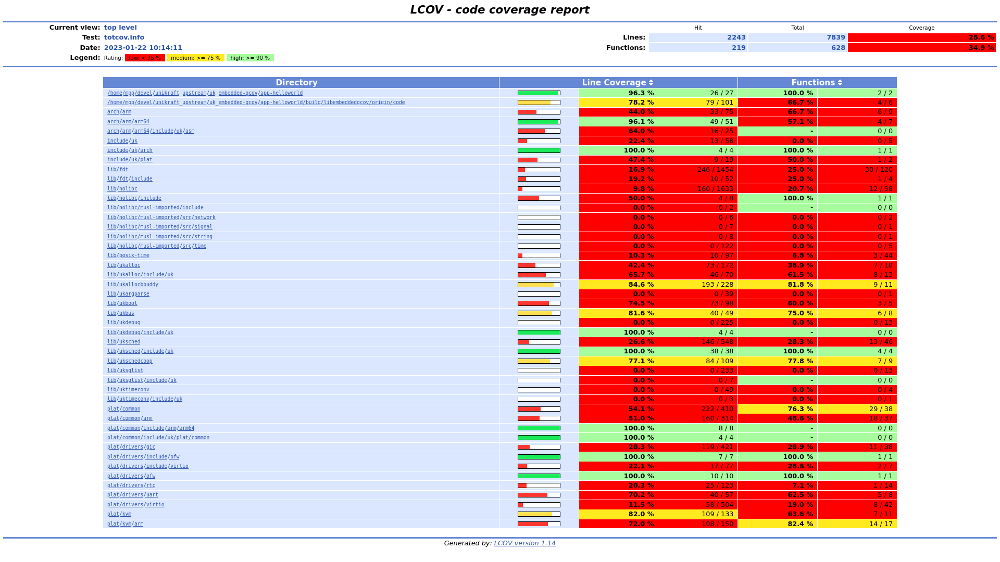

# lib-embedded-gcov

Unikraft port of [embedded-gcov](https://github.com/nasa-jpl/embedded-gcov).

## State

embedded-gcov provides three types of output:
- Binary file
- Memory
- Serial console

So far lib-embedded-gcov has only been tested with console output.

## PoC: app-helloworld

- app-helloworld: [RELEASE-0.11.0](https://github.com/unikraft/app-helloworld/tree/RELEASE-0.11.0)
- lib-embedded-gcov: [introduce-lib-embedded-gcov](https://github.com/michpappas/lib-embedded-gcov/tree/introduce-lib-embedded-gcov).
- unikraft: [RELEASE-0.11.0](https://github.com/unikraft/unikraft/tree/RELEASE-0.11.0)

### Patch app-helloworld

```
--- a/main.c
+++ b/main.c
@@ -1,3 +1,4 @@
+#include <gcov_public.h>
 #include <stdio.h>
 
 /* Import user configuration: */
@@ -41,7 +42,7 @@ int main(int argc, char *argv[])
 #if CONFIG_APPHELLOWORLD_SPINNER
        i = 0;
        printf("\n\n\n");
-       for (;;) {
+       for (int j = 0; j < 10; j++) {
                i %= (monkey3_frame_count * 3);
                printf("\r\033[2A %s \n", monkey3[i++]);
                printf(" %s \n",          monkey3[i++]);
@@ -51,5 +52,7 @@ int main(int argc, char *argv[])
        }
 #endif /* CONFIG_APPHELLOWORLD_SPINNER */
 
+       __gcov_exit();
+
        return 0;
 }
```

For less obtrusive ways to call `__gcov_exit()` see [TODO](#TODO) below.

### Patch unikraft

Nope, no changes are required on Unikraft!!! 🥳

### Configure

- arch: arm64
- plat: kvm
- lib:
  - embedded-gcov
  - posix-time (for [broken nanosleep() dependency](https://github.com/unikraft/app-helloworld/pull/13]))
- app: stay alive

### Build

Download [arm-gnu-toolchain-11.3.rel1-x86_64-aarch64-none-linux-gnu](https://developer.arm.com/-/media/Files/downloads/gnu/11.3.rel1/binrel/arm-gnu-toolchain-11.3.rel1-x86_64-aarch64-none-linux-gnu.tar.xz?rev=8d05006a68d24d929d602804ec9abfb4&hash=E8A66D3B9FF0EFC60A5C041AC3C5EE476349817B)

Build:
```
CROSS_COMPILE=<toolchain-install-path>/bin/aarch64-none-linux-gnu- make
```

### Run and dump console to file

```
qemu-system-aarch64 -machine virt -cpu max -kernel build/app-helloworld_kvm-arm64 -chardev stdio,id=char0,logfile=serial.log,signal=off -serial chardev:char0
```

Wait for 10x monkey frames 🐒. The console dump is in `serial.log`.

### Process results

Run the script in lib-embedded-gcov (just a wrapper around the scripts of embedded-gcov):
```
../libs/lib-embedded-gcov/scripts/gcov_process.sh build/ serial.log
```

Sample output:
```
....
Writing directory view page.
Overall coverage rate:
  lines......: 0.0% (0 of 7839 lines)
  functions..: 0.0% (0 of 628 functions)

lcov report in file:///home/mpp/devel/unikraft_upstream/uk_embedded-gcov/app-helloworld/build/libembeddedgcov/origin/results/html/index.html
```

Open the link in your browser:



## TODO

- Provide an option to register `__gcov_exit()` on the shutdown hook.
- Provide an option to call `__gcov_call_constructors()` and `__gcov_exit()` in the beginning and end of tests in uktest.
- Provide an option to call `__gcov_zero_counters()` on each test in uktest (TBD).
- Binary file output.
  - Requires providing embedded-gcov with filename and implementation of primitives (`open()`, `write()`, `close()` etc).
  - A bit more complex to set up than console (but not too complex)
  - Less appealing to applications that don't natively use a filesystem.
  - Requires implementing parsing tool to convert dump to individual gcda files. Remaining scripts for processing remain as is.
- Memory output.
  - Requires providing embedded-gcov with addrress to buffer.
  - Platform / application needs to be able to reserve that region (ie support `mmap()`).
  - Requires a way to dump region to host (possible with QEMU, gdb).
  - Requires implementing parsing tool to convert dump to individual gcda files. Remaining scripts for processing remain as is.
  - Other clean up work in embedded-gcov and in the processing scripts (we can try to upstream)
